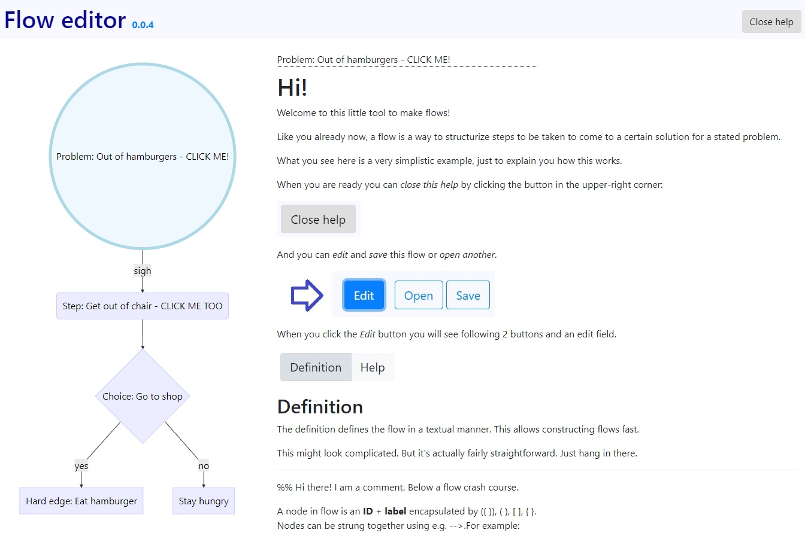

**Live demo [HERE](https://didjeeh.github.io/floweditor)**

# Versions
*   2019-01-08: pre-0.0.7 - Export to docx (not yet perfect)   
*   2019-01-07: 0.0.6     - Possible to fix node naming inconsistencies
*   2019-01-07: pre-0.0.6 - Possible to fix node naming inconsistencies (only in 'Definition' ATM)
*   2019-01-03: 0.0.5     - Added column layouting option
*   2018-12-21: 0.0.4     - More performant help and debugged help selectors
*   2018-12-19: 0.0.3     - Help next to flow and node tooltips
*   2018-12-04: pre-0.0.3 - Help next to flow (needs some work)
*   2018-11-29: 0.0.2     - More user friendly
*   2018-11-28: 0.0.1

# Intro
A small tool to generate flows + help.

# Used technologies
Made out of HTML5, Javascript(jQuery), CSS and <3. No external calls other than linking favicon, css files, js files and some images from a CDN.

See the versions of these in the source of index.html.

# How to use
1.  Use the **Live demo [HERE](https://didjeeh.github.io/floweditor)**
2.  Or clone the repo and

    *   **host** it's content on a web server
    *   use it **standalone** by opening index.html with with a decent and modern browser or Wrap the web app as a desktop application using for instance Electron or NW.js..

Sufficient help is provided in the app itself.

# Credit
*   Favicon:                <https://www.iconfinder.com/icons/216628/flow_icon>, Daniel Bruce, Creative Commons Attribution-Share Alike 3.0 Unported License
*   Layout icons:           <https://www.iconfinder.com/iconsets/interface-12>, Zlatko Najdenovski, Free for personal use only license
*   Visual styling:         <https://getbootstrap.com>, <https://popper.js.org>
*   Flows:                  <https://mermaidjs.github.io>
*   Mardkdown editor:       <https://simplemde.com/> and <https://codemirror.net>
*   Markdown parser:        <https://marked.js.org> and <http://showdownjs.com>
*   SQL helper:             <https://github.com/kripken/sql.js>
*   Saving files:           <https://github.com/eligrey/FileSaver.js>
*   Export to javascript:	<http://evidenceprime.github.io/html-docx-js>
*   Other javascript stuff: <https://jquery.com>
