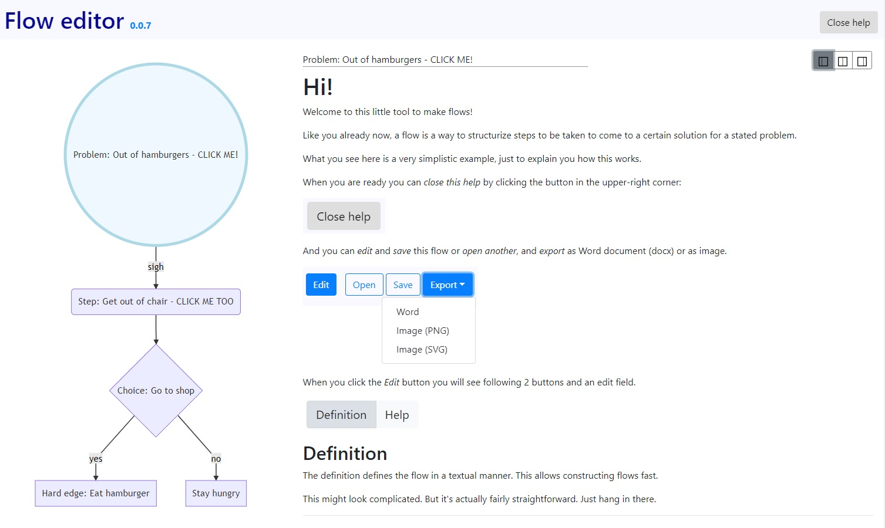

**Live demo [HERE](https://didjeeh.github.io/floweditor)**

# Versions
*   2018-11-29: Release 0.0.2 - More user friendly
*   2018-11-28: Release 0.0.1

# Intro
A small tool to generate flows + help.

# Used technologies
Made out of HTML5, Javascript(jQuery), CSS and <3. No external calls other than linking favicon, css files, js files and some images from a CDN.

See the versions of these in the source of index.html.

# How to use
1.  Use the **Live demo [HERE](https://didjeeh.github.io/floweditor)**
2.  Or clone the repo and

    *   **host** it's content on a web server
    *   use it **standalone** by opening index.html with with a decent and modern browser or Wrap the web app as a desktop application using for instance Electron or NW.js..

Sufficient help is provided in the app itself.

# Credit
*   Favicon: <https://www.iconfinder.com/icons/216628/flow_icon>, Daniel Bruce,
Creative Commons Attribution-Share Alike 3.0 Unported License
*   Visual styling: <https://getbootstrap.com>
*   Javascript stuff: <https://jquery.com>
*   Flows: <https://mermaidjs.github.io>
*   Mardkdown editor: <https://simplemde.com/> and <https://codemirror.net>
*   Markdown parser: <https://marked.js.org>
*   SQL helper: <https://github.com/kripken/sql.js>
*   Saving (downloading) files: <https://github.com/eligrey/FileSaver.js>
